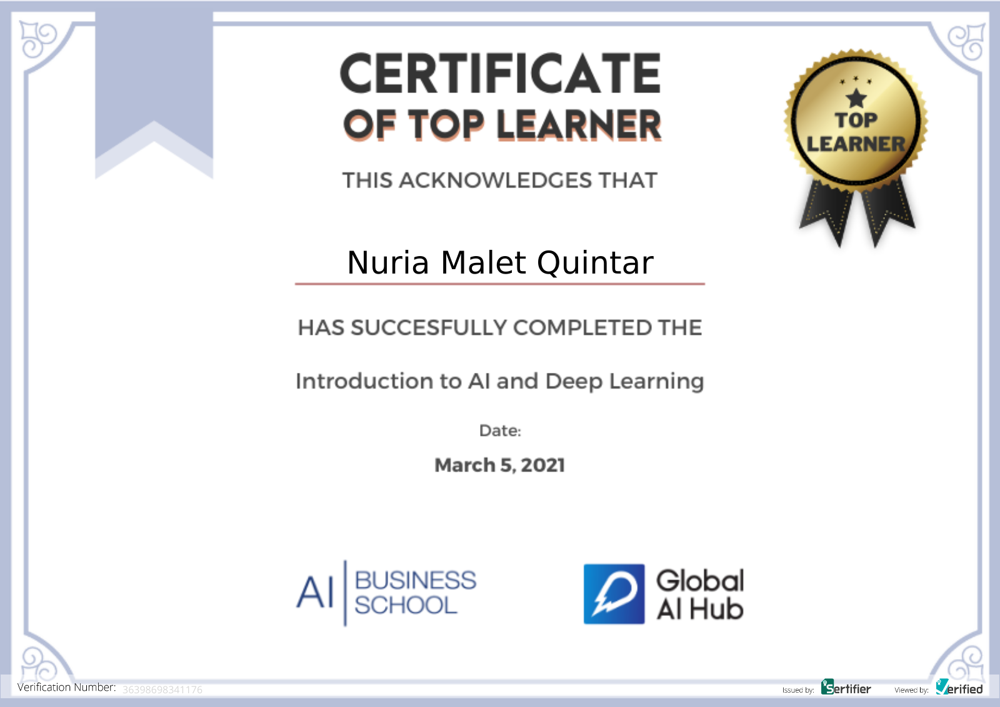

# GlobalAIHubDLCourse

**Course Date:** March 1 to March 5, 2021

**Name:** Nuria Andrea

**Surname:** Malet Quintar

**Email:** nmalet12@gmail.com

## Project:

Image classification project using CIFAR-100 for training. First I create a CNN with Keras, fit the model and use it to predict labels for 5 images downloaded from internet. Then downloaded the vgg16 model and use it to predict the same 5 images. Finally, I retrained the classifier part of the vgg16 with the CIFAR-100 dataset, keeping all other layers as in the original model, then use it to classify the same 5 images. The best results were achived in the last case.

## Requirements

Python Libraries

* numpy
* pandas
* tensorflow/keras
* (for the first homework there are a lot of libraries needed to read different kinds of data)

### Certification

